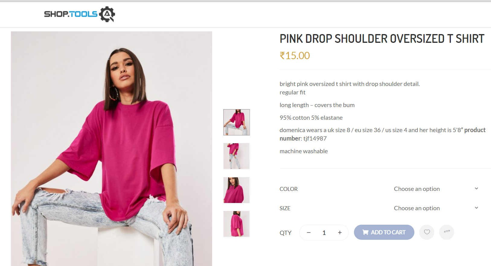

# Demoqa Shop

##Overview

J'ai écrit mes scripts sur Java dans le test que j'ai fait aujourd'hui.
WebDriver est également une interface, il en existe d'autres sous-classes.
Grâce à ceux-ci, je peux accéder à un navigateur. Je peux faire cela avec des codes java. 
Ma framework est basé sur POM (Page Object Model), où nous pouvons garder notre code de tous les éléments plus propre et plus compréhensible.
Il y a 4 packages dans la framework. Le premier est la  package Page pour contenir les Webelements .
Le second est le package Runner qui contient les classes Runner à utiliser dans le framework cucumber.
Le troisième est le package Tests sur lequel j'ai effectué les tests.
Enfin, il y a le package Utilities. Ce paquet contient de nombreuses classes utiles.
Par exemple, grâce à la classe Driver, je peux accéder à différents webdrivers à partir d'autres packages et classes sans créer d'objet.
La classe Configurationreader m'aide à lire les données (données de test) dans le fichier configuration.properties.
Le fichier configuration.properties pour rendre le framework plus lisible
dans lequel je garde les informations confidentiel.

Bien qu'un projet soit mis en œuvre avec une framework, j'ai fait les tâches avec deux soulutions en utilisant deux framework différents 
pour vous montrer mon expérience.
De cette manière, je peux vous présenter mes expériences des frameworks BDD et TDD.

## TestNG

J'ai realisé le scénario donné en utilisant le framework TestNg dans la classe Shop_Solution1.
J'ai utilisé Driver class qui se trouve dans la package Utilities pour aller sur la website.
La méthode getDriver() étant statique dans la classe Driver, j'ai pu l'appeler sans créer d'objet. Les Webelements se trouvent dans la package de pages.
Je les ai appelé en créant un objet. Ce modèle m'a fourni un cadre lisible.

## Cucumber
J'ai utilisé le Cucumber Framework dans la classe Shop_Solution2. Les étapes que j'ai décrites dans shop.feature qui se trouve dans Features
Je les ai eu en exécutant la classe Runner.
Je les ai implémentés dans la classe Shop_Solution2 qui se trouve dans le package Test et ensuite j'ai ecrit les test un par un dans ces méthodes.
J'ai appliqué de la même façon dans cette classe, tout comme dans la classe Shop_Solution1 par rapport à Driver
et Webéléments; j'ai appelé le Driver en utilisant la classe Driver.
Les Webéléments  sont dans le package Page et
Je les ai appelé en créant un objet à partir de la classe

## Link
[DemoqaShop Link](http://shop.demoqa.com/)
